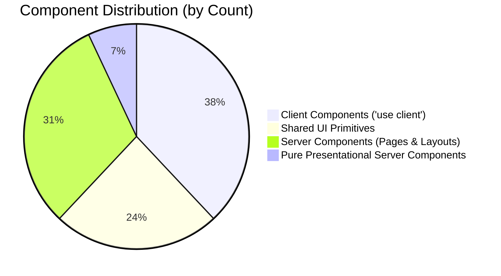

# 01. Repository Architecture & Component Analysis

## Executive Overview

This document provides an exhaustive structural and architectural audit of the **Morao Artisans Accounting** platform. The codebase is a financial and accounting SaaS dashboard built on modern web technologies. This audit serves as the baseline for decoupling the presentation tier from mock seed data and preparing a production migration to **Drizzle ORM** with **PostgreSQL** (Neon serverless) and **SQLite** (Tauri 2 desktop).

---

## 1. Technical Stack & Environment

| Technology | Version / Specification | Architectural Purpose |
| :--- | :--- | :--- |
| **Framework** | Next.js 16.2.3 (App Router) | Server Components (RSC), Turbopack build system, Routing |
| **Runtime / Library** | React 19.2.4 (Canary) / React DOM 19.2.4 | UI rendering engine, Actions, Server Functions |
| **Language** | TypeScript 5.x | Static typing, interface definitions |
| **Styling** | Tailwind CSS v4 (`@tailwindcss/postcss`) | Utility-first styling with CSS variables |
| **UI Primitives** | Radix UI / Base UI / shadcn style | Accessible unstyled primitives (dialogs, popovers, dropdowns, tables) |
| **Data Visualization** | Recharts 3.8.0 | Financial charts (Area, Bar, Pie/Donut, Line) |
| **Motion & Animation** | Motion 12.38.0 (`motion/react`) | Fluid UI transitions, modal animations, tickers |
| **Drag & Drop** | `@dnd-kit/core`, `@dnd-kit/sortable` | Dashboard widget reordering and layout customization |
| **Icons** | Lucide React | Comprehensive iconography |
| **Theme Management** | `next-themes` | Dark / light / system mode persistence |

---

## 2. Directory Structure Audit

The source codebase resides strictly under `src/` with five top-level operational directories:

```
src/
├── app/                  # Next.js App Router routes, layouts, and loading states
│   ├── (auth)/           # Route group for authentication flows (isolated minimal layout)
│   ├── (dashboard)/      # Primary finance/accounting SaaS workspace
│   ├── psi_dashboard/    # Secondary inventory / stock workspace route group
│   ├── globals.css       # Global styles, Tailwind v4 theme tokens, color palettes
│   ├── icon.svg          # Application favicon
│   ├── layout.tsx        # Root HTML shell and ThemeProvider wrapper
│   ├── not-found.tsx     # 404 error page
│   └── page.tsx          # Root index page (redirects to /dashboard)
├── components/           # UI components segmented by domain and primitives
│   ├── accounts/         # Bank and cash accounts management widgets
│   ├── analytics/        # Financial analytics, heatmaps, AI insight widgets
│   ├── budgets/          # Budgeting rings, calendar, and savings goals
│   ├── cards/            # Credit/debit card management and virtual card generator
│   ├── crypto/           # Crypto exchange, wallet, portfolio, and trading forms
│   ├── dashboard/        # Main overview widgets (net worth, cash flow, health score)
│   ├── investments/      # Stocks, holdings table, watchlist, live marquee ticker
│   ├── notifications/    # Notifications list and filter views
│   ├── settings/         # Profile, security, notifications, and appearance tabs
│   ├── support/          # FAQ, help tickets, and system health status
│   ├── transactions/     # Transaction table, search filters, and export tools
│   ├── transfers/        # Wire/quick transfer forms, contacts, and history
│   ├── ui/               # 24 reusable presentation primitives (shadcn/ui)
│   ├── vendors/          # Accounts and vendor management views
│   ├── app-sidebar.tsx   # Global navigation sidebar with workspace switcher
│   ├── command-palette.tsx# Global Cmd+K quick actions and search dialog
│   ├── dynamic-breadcrumb.tsx # Auto-generating breadcrumb from pathname
│   ├── empty-state.tsx   # Reusable empty / zero-data illustration card
│   ├── globe-demo.tsx    # Interactive 3D globe animation for auth views
│   ├── nav-main.tsx      # Sidebar primary collapsible navigation groups
│   ├── nav-secondary.tsx # Sidebar secondary links and notification dropdown
│   ├── nav-user.tsx      # Sidebar user profile dropdown with logout
│   └── theme-toggle.tsx  # Light/dark mode toggle button
├── data/                 # Monolithic mock data and type definitions
│   └── seed.ts           # 1,107 lines of mock data constants and TypeScript types
├── hooks/                # Custom React hooks
│   └── use-mobile.ts     # Window matchMedia breakpoint detector (< 768px)
└── lib/                  # Shared utility functions
    └── utils.ts          # clsx + tailwind-merge helper function (`cn`)
```

---

## 3. Route Inventory & Component Hierarchy

The application features 31 discrete route segments across two major dashboard workspaces and an authentication section.

### 3.1 Root & Authentication Routes

| Route | File Path | Component Rendered | Component Type | Data Dependency |
| :--- | :--- | :--- | :--- | :--- |
| `/` | `src/app/page.tsx` | Next.js Server Redirect (`redirect("/dashboard")`) | Server Component | None |
| `/not-found` | `src/app/not-found.tsx` | Illustrated 404 View | Client Component | None |
| `/sign-in` | `src/app/(auth)/sign-in/page.tsx` | `<SignInPage>` with `<GlobeDemo>` | Client Component | Mock `setTimeout` (1.2s delay) |
| `/sign-up` | `src/app/(auth)/sign-up/page.tsx` | `<SignUpPage>` with `<GlobeDemo>` | Client Component | Mock `setTimeout` (1.5s delay) |

### 3.2 Primary Dashboard Routes: `src/app/(dashboard)/`

All pages in this group share `src/app/(dashboard)/layout.tsx`, which wraps pages in `SidebarProvider`, `AppSidebar`, `DynamicBreadcrumb`, `ThemeToggle`, and `CommandPalette`.

| Route | Page File | Client / Server | Skeletons / Loaders | Primary Subcomponents Rendered |
| :--- | :--- | :--- | :--- | :--- |
| `/dashboard` | `dashboard/page.tsx` | Server Component | `dashboard/loading.tsx` | `<DashboardCustomizer />` (renders `<FinancialOverview />`, `<AccountCards />`, `<QuickTransfer />`, `<SpendingLimit />`, `<MoneyMovement />`, `<HealthScore />`, `<RecentTransactions />`) |
| `/accounts` | `accounts/page.tsx` | Server Component | `accounts/loading.tsx` | `<AccountsPageClient />` (renders `<AccountSummary />`, `<AccountCard />`, `<AddAccount />`) |
| `/transactions` | `transactions/page.tsx` | Server Component | `transactions/loading.tsx` | `<TransactionsPageClient />` (renders `<TransactionSummary />`, `<TransactionFilters />`, `<TransactionTable />`, `<TransactionActions />`) |
| `/transfers` | `transfers/page.tsx` | Server Component | None (direct) | `<TransfersPageClient />` (renders `<TransferStats />`, `<TransferList />`, `<QuickSend />`) |
| `/cards` | `cards/page.tsx` | Server Component | None (direct) | `<CardsPageClient />` (renders `<InteractiveCard />`, `<CardControls />`, `<VirtualCardGenerator />`, `<CardList />`) |
| `/payable` | `payable/page.tsx` | Server Component | `payable/loading.tsx` | `<CryptoPageClient />` (currently aliased to render Crypto features) |
| `/receivable` | `receivable/page.tsx` | Server Component | `receivable/loading.tsx` | `<CryptoPageClient />` (currently aliased to render Crypto features) |
| `/analytics` | `analytics/page.tsx` | Server Component | `analytics/loading.tsx` | `<SpendingHeatmap />`, `<CategoryDonut />`, `<MonthComparison />`, `<RecurringDetector />`, `<AiInsights />` |
| `/investments` | `investments/page.tsx` | Server Component | `investments/loading.tsx` | `<LiveTicker />`, `<PortfolioAllocation />`, `<PerformanceChart />`, `<HoldingsTable />`, `<Watchlist />` |
| `/budgets` | `budgets/page.tsx` | Server Component | None (direct) | `<BudgetRings />`, `<SavingsGoals />`, `<SpendingCalendar />`, `<MonthProjection />` |
| `/vendors` | `vendors/page.tsx` | Server Component | `vendors/loading.tsx` | `<VendorsPageClient />` (duplicate of Accounts with legacy filter categories) |
| `/settings` | `settings/page.tsx` | Server Component | None (direct, wraps in `<Suspense>`) | `<SettingsPageClient />` (Profile, Security, Notifications, Billing, Appearance) |
| `/notifications` | `notifications/page.tsx`| Server Component | None (direct) | `<NotificationsPageClient />` |
| `/support` | `support/page.tsx` | Server Component | `support/loading.tsx` | `<SupportPageClient />` (FAQ accordion, My Tickets, Contact Form, System Status) |
| `/crypto` | `crypto/page.tsx` | Server Component | None (direct) | Server Redirect (`redirect("/payable")`) |

### 3.3 Secondary Workspace: `src/app/psi_dashboard/`

This route group is a parallel clone of the primary dashboard created for the Inventory / PSI workspace view. It replicates 13 route pages (`accounts`, `analytics`, `budgets`, `cards`, `crypto`, `investments`, `notifications`, `settings`, `support`, `transactions`, `transfers`, `vendors`, and root dashboard). Each page imports the identical client components from `src/components/`.

---

## 4. Component Classification & Boundaries

### 4.1 Server Components vs. Client Components

A critical architectural finding is that **the vast majority of business rendering takes place on the client**:



#### Pure Presentational Server Components (No `"use client"` directive):
1. `src/components/accounts/account-summary.tsx`: Computes balance totals and change percentages from passed props.
2. `src/components/transactions/transaction-summary.tsx`: Computes total income, total expense, and largest transaction from passed props.
3. `src/components/transfers/transfer-stats.tsx`: Aggregates sent, received, and scheduled sums from passed props.
4. `src/components/vendors/account-summary.tsx`: Same as accounts summary.
5. `src/components/budgets/savings-goals.tsx`: Statically reads `savingsGoals` directly from `@/data/seed` at request/build time.
6. `src/components/dashboard/recent-transactions.tsx`: Statically reads `recentTransactions` from `@/data/seed`.
7. `src/components/dashboard/spending-limit.tsx`: Statically reads `spendingLimit` from `@/data/seed`.

#### Client Components (Declaring `"use client"`):
All other domain components declare `"use client"` because they either:
- Rely on React local state (`useState`, `useReducer`, `useRef`).
- Use React lifecycle hooks (`useEffect`, `useCallback`, `useMemo`).
- Depend on interactive libraries (`recharts`, `motion/react`, `@dnd-kit`).
- Handle synthetic user events (form submissions, button clicks, tab switches, dropdown triggers).

### 4.2 Shared UI Component Primitives (`src/components/ui/`)

The repository contains 24 modular, unstyled primitives adhering to the shadcn/ui pattern:

| Category | Component Files |
| :--- | :--- |
| **Containers & Surfaces** | `card.tsx`, `sheet.tsx`, `dialog.tsx`, `popover.tsx`, `collapsible.tsx` |
| **Navigation & Menus** | `breadcrumb.tsx`, `dropdown-menu.tsx`, `tabs.tsx`, `sidebar.tsx`, `command.tsx` |
| **Form Inputs** | `button.tsx`, `input.tsx`, `input-group.tsx`, `textarea.tsx`, `checkbox.tsx`, `switch.tsx`, `select.tsx`, `slider.tsx`, `calendar.tsx` |
| **Data Presentation** | `table.tsx`, `badge.tsx`, `avatar.tsx`, `progress.tsx`, `separator.tsx`, `skeleton.tsx`, `tooltip.tsx`, `chart.tsx` |
| **Specialized Media** | `globe.tsx` (cobe WebGL 3D globe renderer) |

---

## 5. Architectural Findings & Key Risks Identified

1. **Seed File Acting as Double Agent**:
   `src/data/seed.ts` is simultaneously serving two incompatible purposes:
   - Defining the TypeScript domain models for the entire frontend.
   - Supplying static mock arrays.
   *Risk*: Any change to mock data risks breaking types across components, and components cannot be decoupled without first extracting interfaces into a dedicated type layer.

2. **Route Duplication Between `(dashboard)` and `psi_dashboard`**:
   The two workspaces duplicate 13 routes and render the exact same finance components instead of inventory components.
   *Recommendation*: Refactor routing to share layout logic and cleanly segregate domain contexts.

3. **Missing Data Access Layer**:
   No data fetching layer exists. There are zero API routes (`/api/*`), zero Server Actions (`"use server"`), zero database clients, and zero caching layers (`next/cache`).
   *Migration Requirement*: Implement a clean 3-tier architecture: Presentation Layer $\rightarrow$ Server Actions / Service Layer $\rightarrow$ Drizzle ORM Adapter $\rightarrow$ PostgreSQL / SQLite.
