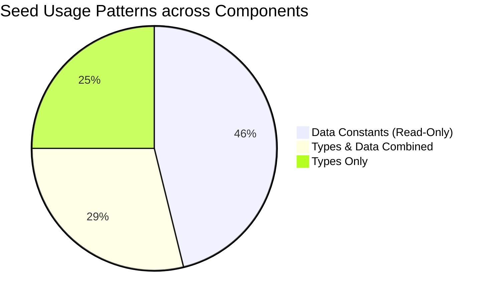

# 04. Monolithic Seed Dependency Report

## Executive Summary

This report catalogues all **52 distinct import sites** referencing `src/data/seed.ts` across the application. The audit analyzes which symbols are imported, how they are consumed (types, read-only display, local state initialization, or synthetic mutations), and assigns a refactoring complexity score to guide safe decoupling.

---

## 1. Monolithic Seed Inventory Summary

- **Total Direct Import Statements**: 52
- **Files Importing Types Only**: 13
- **Files Importing Data Constants Only**: 24
- **Files Importing Both Types & Data**: 15
- **Files Performing In-Memory Mutations**: 8



---

## 2. Complete Seed Import Cross-Reference Table

| # | File Path | Imported Symbols | Type of Import | Usage in Component | Decoupling Complexity |
| :---: | :--- | :--- | :--- | :--- | :---: |
| **1** | `src/components/accounts/account-grid.tsx` | `type BankAccount` | Type only | Prop interface for rendering account cards | **Low** |
| **2** | `src/components/accounts/account-summary.tsx` | `type BankAccount` | Type only | Computes total balance and percentage change | **Low** |
| **3** | `src/components/accounts/accounts-page-client.tsx` | `bankAccounts`, `type BankAccount` | Data + Type | Initializes `useState<BankAccount[]>(bankAccounts)` | **Medium** |
| **4** | `src/components/accounts/add-account.tsx` | `type BankAccount` | Type only | Generates synthetic `ba-${Date.now()}` in `setTimeout` | **Medium** |
| **5** | `src/components/analytics/ai-insights.tsx` | `aiInsights` | Data only | Renders AI insight cards and impact scores | **Low** |
| **6** | `src/components/analytics/category-donut.tsx` | `categoryBreakdowns` | Data only | Recharts donut chart for category spending | **Low** |
| **7** | `src/components/analytics/month-comparison.tsx` | `monthComparisons` | Data only | Bar chart comparing spending across two months | **Low** |
| **8** | `src/components/analytics/recurring-detector.tsx` | `recurringCharges`, `type RecurringCharge` | Data + Type | Renders detected recurring subscription charges | **Low** |
| **9** | `src/components/analytics/spending-heatmap.tsx` | `spendingHeatmapData` | Data only | Renders 365-day SVG spending intensity matrix | **Medium** |
| **10** | `src/components/budgets/budget-rings.tsx` | `budgetCategories` | Data only | Computes SVG circle circumference for monthly budgets | **Low** |
| **11** | `src/components/budgets/month-projection.tsx` | `budgetCategories`, `dailySpending` | Data only | Recharts area chart projecting end-of-month spend | **Medium** |
| **12** | `src/components/budgets/savings-goals.tsx` | `savingsGoals` | Data only | Statically renders savings goal progress bars | **Low** |
| **13** | `src/components/budgets/spending-calendar.tsx` | `dailySpending` | Data only | Renders 30-day spending activity calendar | **Low** |
| **14** | `src/components/cards/card-controls.tsx` | `type CardData` | Type only | Card freeze toggle and daily limit sliders | **Low** |
| **15** | `src/components/cards/card-list.tsx` | `type CardData` | Type only | Grid of selectable physical/virtual cards | **Low** |
| **16** | `src/components/cards/cards-page-client.tsx` | `cardsData`, `type CardData` | Data + Type | `useState(cardsData)`, `frozenMap`, and `dailyLimits` | **High** |
| **17** | `src/components/cards/interactive-card.tsx` | `type CardData` | Type only | 3D-styled interactive credit card with flip animation | **Low** |
| **18** | `src/components/cards/virtual-card-generator.tsx` | `type CardData` | Type only | Generates random 16-digit PANs and CVVs in RAM | **High** |
| **19** | `src/components/command-palette.tsx` | `contacts`, `recentTransactions`, `cryptoCoins` | Data only | Global Cmd+K quick actions and search list | **Medium** |
| **20** | `src/components/crypto/coin-insight.tsx` | `cryptoCoins` | Data only | Displays market cap, 24h volume, and sentiment | **Low** |
| **21** | `src/components/crypto/crypto-page-client.tsx` | `cryptoCoins` | Data only | Live price simulation interval drifting prices | **High** |
| **22** | `src/components/crypto/market-overview.tsx` | `cryptoCoins` | Data only | Crypto market summary metrics | **Low** |
| **23** | `src/components/crypto/my-balance.tsx` | `cryptoCoins` | Data only | Calculates portfolio total from drifting prices | **Medium** |
| **24** | `src/components/crypto/my-portfolio.tsx` | `cryptoCoins` | Data only | Asset holdings breakdown | **Low** |
| **25** | `src/components/crypto/top-coins.tsx` | `cryptoCoins` | Data only | Horizontal coin cards with sparklines | **Low** |
| **26** | `src/components/crypto/trade-form.tsx` | `cryptoCoins` | Data only | Mock swap/exchange order execution form | **Medium** |
| **27** | `src/components/dashboard/account-cards.tsx` | `accountCards`, `walletBalance` | Data only | Net worth card, wallet balance, and quick actions | **Low** |
| **28** | `src/components/dashboard/financial-overview.tsx` | `financialOverview` | Data only | Income vs Expense area chart with period toggles | **Low** |
| **29** | `src/components/dashboard/health-score.tsx` | `financialHealthScore`, `type HealthFactor` | Data + Type | Score gauge and breakdown factors | **Low** |
| **30** | `src/components/dashboard/money-movement.tsx` | `moneyMovementByPeriod` | Data only | Inflow vs Outflow bar chart for 7d/30d/90d | **Low** |
| **31** | `src/components/dashboard/quick-transfer.tsx` | `contacts` | Data only | Send money widget in overview dashboard | **Medium** |
| **32** | `src/components/dashboard/recent-transactions.tsx`| `recentTransactions` | Data only | Server Component rendering latest 5 transactions | **Low** |
| **33** | `src/components/dashboard/spending-limit.tsx` | `spendingLimit` | Data only | Server Component rendering monthly budget bar | **Low** |
| **34** | `src/components/investments/holdings-table.tsx` | `holdings as seedHoldings`, `type Holding` | Data + Type | Live price simulation `setInterval` & table sort | **High** |
| **35** | `src/components/investments/live-ticker.tsx` | `holdings`, `watchlistItems` | Data only | Marquee ticker calculating gains/losses | **Medium** |
| **36** | `src/components/investments/performance-chart.tsx`| `portfolioHistory` | Data only | Recharts area chart comparing Portfolio vs S&P 500 | **Low** |
| **37** | `src/components/investments/portfolio-allocation.tsx`| `holdings` | Data only | useMemo aggregating sector values into PieChart | **Medium** |
| **38** | `src/components/investments/watchlist.tsx` | `watchlistItems`, `type WatchlistItem` | Data + Type | Watchlist cards with mini sparklines | **Low** |
| **39** | `src/components/nav-secondary.tsx` | `notifications` | Data only | Module-level unread count and popover list | **High** |
| **40** | `src/components/notifications/notifications-page-client.tsx`| `notifications as seedNotifications`, `type Notification` | Data + Type | `useState(seedNotifications)`, filter, mark read, dismiss | **Medium** |
| **41** | `src/components/support/support-page-client.tsx` | `faqItems`, `supportTickets`, `systemStatus`, `type FaqItem`, `type SupportTicket` | Data + Type | FAQ search, tickets list, and uptime metrics | **Medium** |
| **42** | `src/components/transactions/transaction-summary.tsx`| `type FullTransaction` | Type only | Pure presentation calculating aggregates via props | **Low** |
| **43** | `src/components/transactions/transaction-table.tsx` | `type FullTransaction` | Type only | Interactive data table with sorting and rows | **Low** |
| **44** | `src/components/transactions/transactions-page-client.tsx`| `fullTransactions`, `type FullTransaction` | Data + Type | Search, category filters, CSV export, expanded row | **High** |
| **45** | `src/components/transfers/quick-send.tsx` | `contacts`, `type TransferRecord` | Data + Type | Contact picker, amount input, simulated send | **Medium** |
| **46** | `src/components/transfers/transfer-list.tsx` | `type TransferRecord` | Type only | Renders transfer transaction rows with cancel button | **Low** |
| **47** | `src/components/transfers/transfer-stats.tsx` | `type TransferRecord` | Type only | Aggregates sent, received, and scheduled totals | **Low** |
| **48** | `src/components/transfers/transfers-page-client.tsx`| `transferRecords`, `type TransferRecord` | Data + Type | `useState(transferRecords)`, cancel transfer in RAM | **Medium** |
| **49** | `src/components/vendors/account-grid.tsx` | `type BankAccount` | Type only | Vendor/account card display | **Low** |
| **50** | `src/components/vendors/account-summary.tsx` | `type BankAccount` | Type only | Vendor/account summary statistics | **Low** |
| **51** | `src/components/vendors/add-account.tsx` | `type BankAccount` | Type only | Vendor account connection modal | **Medium** |
| **52** | `src/components/vendors/vendors-page-client.tsx` | `bankAccounts`, `type BankAccount` | Data + Type | Duplicate of accounts-page-client with legacy tabs | **Medium** |

---

## 3. High-Risk Seed Coupling Scenarios

### 3.1 Module-Level Static Calculation: `src/components/nav-secondary.tsx`
- **Line 41**:
  ```typescript
  const unreadCount = notifications.filter((n) => !n.read).length
  ```
- **The Problem**: This statement runs once when the JavaScript module is evaluated in the browser. When the user navigates to `/notifications` and marks items as read, `NotificationsPageClient` mutates its own React state, but the top sidebar in `nav-secondary.tsx` **never re-renders** or updates because it evaluated a static import.
- **Remediation**: The unread notification count must be managed via a global React Context, TanStack Query cache, or a Server Action cache invalidation trigger with Next.js 16 `refresh()`.

### 3.2 Live Price Interval Simulators (`crypto-page-client.tsx`, `holdings-table.tsx`)
- **The Problem**: These components spin up `setInterval(..., 3000)` on mount, mutating their local prices copy every 3 seconds to create a visual "flashing" market experience.
- **The Risk**: When hooked up to a real database, components must not continuously spam write requests to the database to update prices.
- **Remediation**: Market price streaming should either remain client-side (via WebSockets / Server-Sent Events) or connect to a dedicated live price quote cache without writing each 3-second tick to PostgreSQL.

### 3.3 Synthetic ID Generation in Presentation Components
- Multiple components generate mock primary keys using client clock timestamps:
  - `add-account.tsx`: `id: ba-${Date.now()}`
  - `quick-send.tsx`: `id: tr-${Date.now()}`
  - `virtual-card-generator.tsx`: `id: vc-${Date.now()}`
- **The Risk**: Client-generated IDs collide in multi-user concurrent environments and break UUID/serial database conventions.
- **Remediation**: All ID generation must be offloaded to the database (`uuid_generate_v4()` or `gen_random_uuid()`) through Server Actions.
