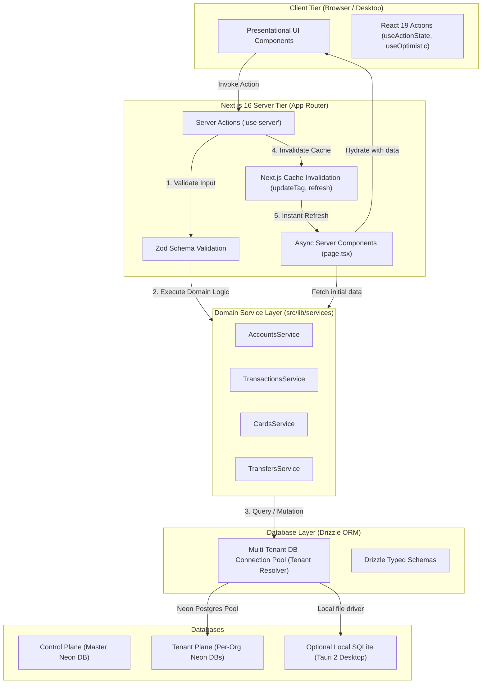

# 05. Target Database Architecture & Migration Plan

## Executive Overview

This plan defines the production-grade target architecture to transition **Morao Artisans Accounting** from static in-memory mock data to a resilient, multi-tenant database platform. The target stack combines **Next.js 16 (App Router)**, **TypeScript**, **Drizzle ORM**, and **PostgreSQL (Neon Serverless)**, engineered with a dual-dialect schema that enables drop-in compatibility with **SQLite** for future standalone desktop deployments via **Tauri 2**.

---

## 1. System Architecture & Boundaries



### 1.1 The 3-Tier Layering Rules
1. **Presentation Layer (`src/components/`, `src/app/`)**:
   - Zero SQL or database queries.
   - Client components receive typed data as props from Server Components or hooks.
   - All mutations trigger typed Server Actions.
2. **Domain Service Layer (`src/lib/services/`)**:
   - Encapsulates all business rules, calculations (net changes, balances, fees), and database interactions.
   - Functions are pure async TypeScript functions decoupled from HTTP or Next.js headers/cookies.
3. **Database Access Layer (`src/lib/db/`)**:
   - Contains Drizzle ORM schemas, migration scripts, and dynamic connection pool resolvers.

---

## 2. Multi-Tenant Architecture: Control Plane vs. Tenant Plane

To prevent cross-tenant data leaks and allow independent Point-In-Time-Recovery (PITR) for accounting clients, the system adopts a dual-plane architecture:

```
┌────────────────────────────────────────────────────────┐
│             Control Plane (Master Neon DB)             │
├────────────────────────────────────────────────────────┤
│ • users: Master accounts & authentication profiles     │
│ • organizations: Business accounts & subscription tiers│
│ • organization_members: User-to-organization RBAC      │
│ • tenant_databases: Encrypted connection credentials   │
└──────────────────────────┬─────────────────────────────┘
                           │ Dynamic Connection Resolution
                           ▼
┌────────────────────────────────────────────────────────┐
│           Tenant Plane (Per-Organization DB)           │
├────────────────────────────────────────────────────────┤
│ • bank_accounts        • cards          • budgets      │
│ • transactions         • contacts       • savings_goals│
│ • transfers            • holdings       • tickets      │
└────────────────────────────────────────────────────────┘
```

### 2.1 Dynamic Connection Resolver (`src/lib/db/tenant.ts`)

```typescript
import { drizzle } from "drizzle-orm/neon-serverless"
import { Pool } from "@neondatabase/serverless"
import * as tenantSchema from "./schemas/tenant"

// Cache connection pools per tenant to prevent exhausting sockets
const poolCache = new Map<string, Pool>()

export async function getTenantDb(organizationId: string) {
  // 1. Fetch connection string from Control Plane for this organization
  const config = await getTenantDbConfig(organizationId)

  // 2. Reuse cached pool or create new
  let pool = poolCache.get(organizationId)
  if (!pool) {
    pool = new Pool({ connectionString: config.connectionString })
    poolCache.set(organizationId, pool)
  }

  // 3. Return Drizzle instance bound to tenant schema
  return drizzle(pool, { schema: tenantSchema })
}
```

---

## 3. Drizzle ORM Schema Specification

### 3.1 Dual-Dialect Compatibility (PostgreSQL + SQLite)

To allow the exact same codebase to power the Neon PostgreSQL web SaaS and the Tauri SQLite desktop app, schemas utilize standard relational types and modular table builders:

```typescript
// src/lib/db/schemas/tenant.ts
import {
  pgTable,
  uuid,
  varchar,
  bigint,
  text,
  timestamp,
  boolean,
  smallint,
  integer,
} from "drizzle-orm/pg-core"

// ── 1. Bank Accounts ──────────────────────────────────────────────────────────
export const bankAccounts = pgTable("bank_accounts", {
  id: uuid("id").defaultRandom().primaryKey(),
  name: varchar("name", { length: 120 }).notNull(),
  type: varchar("type", { length: 50 }).notNull(), // 'Bank Accounts', 'Cash', 'brokerage', etc.
  bankType: varchar("bank_type", { length: 30 }),  // 'checking', 'savings'
  institution: varchar("institution", { length: 100 }).notNull(),
  institutionLogo: text("institution_logo"),
  accountNumberMasked: varchar("account_number_masked", { length: 20 }).notNull(),
  balanceCents: bigint("balance_cents", { mode: "number" }).notNull().default(0),
  currency: varchar("currency", { length: 3 }).notNull().default("USD"),
  color: varchar("color", { length: 50 }).notNull().default("bg-blue-500"),
  createdAt: timestamp("created_at", { withTimezone: true }).defaultNow().notNull(),
  updatedAt: timestamp("updated_at", { withTimezone: true }).defaultNow().notNull(),
})

// ── 2. Transactions Ledger ───────────────────────────────────────────────────
export const transactions = pgTable("transactions", {
  id: uuid("id").defaultRandom().primaryKey(),
  accountId: uuid("account_id").notNull().references(() => bankAccounts.id, { onDelete: "cascade" }),
  referenceCode: varchar("reference_code", { length: 50 }).notNull().unique(),
  merchant: varchar("merchant", { length: 150 }).notNull(),
  merchantLogo: text("merchant_logo"),
  category: varchar("category", { length: 80 }).notNull(),
  amountCents: bigint("amount_cents", { mode: "number" }).notNull(),
  feeCents: bigint("fee_cents", { mode: "number" }).notNull().default(0),
  type: varchar("type", { length: 20 }).notNull(), // 'income' | 'expense'
  status: varchar("status", { length: 20 }).notNull().default("completed"),
  notes: text("notes"),
  transactedAt: timestamp("transacted_at", { withTimezone: true }).notNull(),
  createdAt: timestamp("created_at", { withTimezone: true }).defaultNow().notNull(),
})

// ── 3. Cards Management ───────────────────────────────────────────────────────
export const cards = pgTable("cards", {
  id: uuid("id").defaultRandom().primaryKey(),
  accountId: uuid("account_id").references(() => bankAccounts.id),
  name: varchar("name", { length: 100 }).notNull(),
  type: varchar("type", { length: 20 }).notNull(), // 'physical' | 'virtual'
  network: varchar("network", { length: 30 }).notNull(), // 'visa' | 'mastercard'
  last4: varchar("last_4", { length: 4 }).notNull(),
  holder: varchar("holder", { length: 120 }).notNull(),
  expiryMonth: smallint("expiry_month").notNull(),
  expiryYear: smallint("expiry_year").notNull(),
  isFrozen: boolean("is_frozen").notNull().default(false),
  dailyLimitCents: bigint("daily_limit_cents", { mode: "number" }).notNull().default(100000),
  monthlyLimitCents: bigint("monthly_limit_cents", { mode: "number" }).notNull().default(500000),
  colorScheme: varchar("color_scheme", { length: 80 }),
  createdAt: timestamp("created_at", { withTimezone: true }).defaultNow().notNull(),
})

// ── 4. Contacts & Transfers ──────────────────────────────────────────────────
export const contacts = pgTable("contacts", {
  id: uuid("id").defaultRandom().primaryKey(),
  name: varchar("name", { length: 150 }).notNull(),
  email: varchar("email", { length: 255 }).notNull(),
  phone: varchar("phone", { length: 50 }),
  avatarUrl: text("avatar_url"),
  createdAt: timestamp("created_at", { withTimezone: true }).defaultNow().notNull(),
})

export const transfers = pgTable("transfers", {
  id: uuid("id").defaultRandom().primaryKey(),
  fromAccountId: uuid("from_account_id").references(() => bankAccounts.id),
  contactId: uuid("contact_id").notNull().references(() => contacts.id),
  amountCents: bigint("amount_cents", { mode: "number" }).notNull(),
  type: varchar("type", { length: 20 }).notNull(), // 'sent' | 'received' | 'scheduled'
  status: varchar("status", { length: 20 }).notNull().default("completed"),
  note: text("note"),
  executedAt: timestamp("executed_at", { withTimezone: true }).defaultNow(),
  createdAt: timestamp("created_at", { withTimezone: true }).defaultNow().notNull(),
})

// ── 5. Budgets & Savings Goals ────────────────────────────────────────────────
export const budgets = pgTable("budgets", {
  id: uuid("id").defaultRandom().primaryKey(),
  category: varchar("category", { length: 80 }).notNull(),
  budgetAmountCents: bigint("budget_amount_cents", { mode: "number" }).notNull(),
  iconName: varchar("icon_name", { length: 50 }).notNull(),
  color: varchar("color", { length: 50 }).notNull(),
  periodMonth: smallint("period_month").notNull(),
  periodYear: integer("period_year").notNull(),
})

export const savingsGoals = pgTable("savings_goals", {
  id: uuid("id").defaultRandom().primaryKey(),
  name: varchar("name", { length: 150 }).notNull(),
  targetAmountCents: bigint("target_amount_cents", { mode: "number" }).notNull(),
  currentAmountCents: bigint("current_amount_cents", { mode: "number" }).notNull().default(0),
  monthlyContributionCents: bigint("monthly_contribution_cents", { mode: "number" }).notNull().default(0),
  deadline: timestamp("deadline", { withTimezone: true }).notNull(),
  iconName: varchar("icon_name", { length: 50 }).notNull(),
  color: varchar("color", { length: 50 }).notNull(),
  createdAt: timestamp("created_at", { withTimezone: true }).defaultNow().notNull(),
})
```

---

## 4. Next.js 16 Data Flow & Server Action Patterns

### 4.1 Future Accounts Flow (Fetching & Rendering)

1. User requests `/accounts`.
2. Next.js executes `src/app/(dashboard)/accounts/page.tsx` as an **Async Server Component**:
   ```typescript
   // src/app/(dashboard)/accounts/page.tsx
   import { getTenantDb } from "@/lib/db/tenant"
   import { AccountsService } from "@/lib/services/accounts.service"
   import { AccountsPageClient } from "@/components/accounts/accounts-page-client"
   import { getCurrentOrgId } from "@/lib/auth/session"

   export default async function Page() {
     const orgId = await getCurrentOrgId()
     const db = await getTenantDb(orgId)
     const accounts = await AccountsService.listAccounts(db)
     const summary = await AccountsService.getSummary(db)

     return (
       <div className="flex flex-1 flex-col gap-4 p-4 pt-0">
         <AccountsPageClient initialAccounts={accounts} initialSummary={summary} />
       </div>
     )
   }
   ```
3. Data is pre-rendered on the server and delivered directly to the client with zero initial client-side network roundtrips.

### 4.2 Future Mutation Flow (Adding an Account via Server Action)

```typescript
// src/app/actions/accounts.ts
"use server"

import { z } from "zod"
import { updateTag } from "next/cache"
import { getTenantDb } from "@/lib/db/tenant"
import { AccountsService } from "@/lib/services/accounts.service"
import { getCurrentOrgId } from "@/lib/auth/session"

const AddAccountSchema = z.object({
  institution: z.string().min(2).max(100),
  accountType: z.enum(["checking", "savings", "crypto", "investment"]),
  accountNumber: z.string().min(4).max(20),
})

export async function addAccountAction(formData: FormData) {
  const orgId = await getCurrentOrgId()
  const db = await getTenantDb(orgId)

  const validated = AddAccountSchema.safeParse({
    institution: formData.get("institution"),
    accountType: formData.get("accountType"),
    accountNumber: formData.get("accountNumber"),
  })

  if (!validated.success) {
    return { success: false, errors: validated.error.flatten().fieldErrors }
  }

  try {
    const newAccount = await AccountsService.createAccount(db, validated.data)

    // Next.js 16: Immediate read-your-writes cache invalidation
    updateTag(`org-${orgId}-accounts`)

    return { success: true, data: newAccount }
  } catch (err) {
    return { success: false, message: "Failed to connect account" }
  }
}
```

---

## 5. Rollback Strategy & Risk Mitigations

1. **Dual-Read Migration Period**:
   During initial rollout, if database connection fails, fallback to `seed.ts` mock data to prevent application downtime in staging environments.
2. **Transaction Isolation**:
   All balance-modifying operations (such as transfers debiting account A and crediting account B) are strictly wrapped in Drizzle SQL transactions:
   ```typescript
   await db.transaction(async (tx) => {
     await tx.update(bankAccounts).set(...).where(eq(bankAccounts.id, fromId))
     await tx.update(bankAccounts).set(...).where(eq(bankAccounts.id, toId))
     await tx.insert(transfers).values(...)
   })
   ```
3. **Database Migration Versioning**:
   Managed via `drizzle-kit generate` and `drizzle-kit migrate`, tracking schema changes in versioned SQL files under `drizzle/migrations/`.
