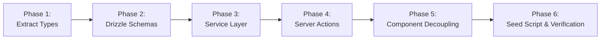

# 06. Implementation Roadmap & File Classification Matrix

## Executive Summary

This document specifies the execution order for transitioning **Morao Artisans Accounting** from mock seed data to a production database architecture. It establishes clear architectural boundaries by classifying every existing file into one of three categories: **Keep Unchanged**, **Possible Future Modification**, or **Replace / Refactor Later**. It outlines a phased, risk-mitigated rollout strategy that guarantees zero visual regressions.

---

## 1. Phased Implementation Roadmap

### Phase 1: Extract Domain Types (Zero Code Logic Changes)
- **Goal**: Sever the circular dependency where UI components import TypeScript interfaces from the mock seed file.
- **Actions**:
  1. Create `src/types/`:
     - `accounts.ts` (`BankAccount`, `AccountCard`)
     - `transactions.ts` (`Transaction`, `FullTransaction`)
     - `cards.ts` (`CardData`)
     - `budgets.ts` (`BudgetCategory`, `SavingsGoal`, `DailySpending`)
     - `transfers.ts` (`TransferRecord`, `Contact`)
     - `investments.ts` (`Holding`, `WatchlistItem`, `PortfolioHistoryPoint`)
     - `notifications.ts` (`Notification`)
     - `support.ts` (`SupportTicket`, `FaqItem`)
     - `crypto.ts` (`CryptoCoin`, `CryptoTransaction`)
  2. Point all 52 components to `@/types/*` instead of `@/data/seed`.
- **Validation**: `npm run build` succeeds with zero errors; UI remains 100% identical.

### Phase 2: Drizzle ORM Schemas & Database Setup
- **Goal**: Establish typed relational tables for Neon PostgreSQL and local SQLite.
- **Actions**:
  1. Install `drizzle-orm`, `drizzle-kit`, and `@neondatabase/serverless`.
  2. Create `src/lib/db/`:
     - `src/lib/db/client.ts` (connection pool manager)
     - `src/lib/db/schema/` (typed table definitions)
  3. Generate and run initial migrations (`drizzle-kit generate`).

### Phase 3: Service Layer & Repository Implementation
- **Goal**: Create pure business logic and database queries decoupled from Next.js request context.
- **Actions**:
  1. Implement `src/lib/services/`:
     - `accounts.service.ts`: `listAccounts()`, `getAccountById()`, `createAccount()`, `getSummary()`
     - `transactions.service.ts`: `listTransactions(filters, pagination)`, `getSummaryStats()`, `createTransaction()`
     - `cards.service.ts`: `listCards()`, `toggleFreeze()`, `updateLimit()`
     - `transfers.service.ts`: `listTransfers()`, `executeTransfer()`
     - `budgets.service.ts`: `listBudgetsWithCalculatedSpend()`, `listSavingsGoals()`
     - `notifications.service.ts`: `listNotifications()`, `markAsRead()`, `getUnreadCount()`
  2. Write unit tests for services using in-memory SQLite.

### Phase 4: Server Actions & Cache Invalidation
- **Goal**: Implement secure data mutation entrypoints using Next.js 16 Server Actions.
- **Actions**:
  1. Create `src/app/actions/`:
     - Validate input via Zod schemas.
     - Call corresponding service function.
     - Trigger Next.js 16 cache invalidation: `updateTag()` for immediate write-through refresh and `refresh()` for client router synchronization.

### Phase 5: Component Decoupling & Server Component Integration
- **Goal**: Transform passive pages into data-fetching Server Components and convert client components into presentational consumers.
- **Sequential Migration by Route**:
  1. **Route 1: `/accounts`**: Pass server-fetched accounts to `AccountsPageClient`; replace `useState(bankAccounts)` with props; connect `AddAccount` to `addAccountAction`.
  2. **Route 2: `/transactions`**: Replace client-side array filters with server-driven search parameters and pagination.
  3. **Route 3: `/cards`**: Connect freeze toggles and limit updates to Server Actions.
  4. **Route 4: `/transfers`**: Connect `QuickSend` to real database transfer action.
  5. **Route 5: `/budgets`**: Connect budget categories and savings goals.
  6. **Route 6: `/notifications`**: Synchronize notification unread state between `/notifications` page and sidebar header popover.
  7. **Route 7: `/dashboard`**: Pass aggregated statistics to overview widgets.

### Phase 6: Seed Database Migration Script & Cleanup
- **Goal**: Populate the production database with existing mock data and deprecate `src/data/seed.ts`.
- **Actions**:
  1. Create `scripts/seed-database.ts` to ingest all records from `src/data/seed.ts` into PostgreSQL.
  2. Archive or delete `src/data/seed.ts`.

---

## 2. File Boundary Classification Matrix

Every file in the repository is catalogued below with its migration classification:

### 2.1 Keep Unchanged (No Modifications Needed)
These files represent presentation primitives, static styling, or low-level utilities that have zero coupling to data stores:

| Directory | Files | Rationale |
| :--- | :--- | :--- |
| **`src/components/ui/`** | `avatar.tsx`, `badge.tsx`, `breadcrumb.tsx`, `button.tsx`, `calendar.tsx`, `card.tsx`, `chart.tsx`, `checkbox.tsx`, `collapsible.tsx`, `command.tsx`, `dialog.tsx`, `dropdown-menu.tsx`, `globe.tsx`, `input-group.tsx`, `input.tsx`, `popover.tsx`, `progress.tsx`, `select.tsx`, `separator.tsx`, `sheet.tsx`, `sidebar.tsx`, `skeleton.tsx`, `slider.tsx`, `switch.tsx`, `table.tsx`, `tabs.tsx`, `textarea.tsx`, `tooltip.tsx` | Pure design system primitives (shadcn/ui). Receive standard HTML/React props. |
| **`src/hooks/`** | `use-mobile.ts` | Responsive viewport utility hook. |
| **`src/lib/`** | `utils.ts` | Tailwind class merger (`cn`). |
| **`src/app/`** | `globals.css`, `icon.svg`, `not-found.tsx` | Static assets, theme tokens, and 404 page. |
| **`src/components/`** | `empty-state.tsx`, `globe-demo.tsx`, `theme-toggle.tsx` | Pure presentational components. |

---

### 2.2 Possible Future Modification (Minor Interface Updates)
These files will be updated to accept typed props, server actions, or new parameters, but their core layout and presentation logic will remain intact:

| File Path | Current Role | Future Modification Required |
| :--- | :--- | :--- |
| `src/app/(dashboard)/layout.tsx` | Dashboard shell layout | Pass real organization profile and notification count to sidebar |
| `src/app/layout.tsx` | Root HTML shell | Wrap with global session / organization provider |
| `src/components/app-sidebar.tsx` | Sidebar navigation & org switcher | Bind organization switcher to real tenant organizations |
| `src/components/nav-secondary.tsx` | Secondary links & notification popup | Receive dynamic `unreadCount` and latest notifications from server |
| `src/components/command-palette.tsx` | Cmd+K search dialog | Query dynamic transactions and contacts instead of static seed arrays |
| `src/components/accounts/account-summary.tsx` | Accounts statistics | Accept pre-computed server aggregates |
| `src/components/accounts/account-grid.tsx` | Account card grid | Use domain types from `@/types/accounts` |
| `src/components/transactions/transaction-table.tsx`| Transaction data table | Support server-side pagination and sorting props |
| `src/components/transactions/transaction-filters.tsx`| Transaction search/filters | Bind filters to URL query parameters (`searchParams`) |
| `src/components/cards/interactive-card.tsx` | 3D card presentation | Use domain types from `@/types/cards` |
| `src/components/cards/card-list.tsx` | Card list grid | Use domain types from `@/types/cards` |
| `src/components/transfers/transfer-list.tsx` | Transfer history rows | Support cancellation Server Action callback |
| `src/components/budgets/budget-rings.tsx` | Monthly budget rings | Accept real calculated spend figures from server |
| `src/components/investments/holdings-table.tsx` | Holdings stock table | Receive positions from DB, keep live price streaming decoupled |

---

### 2.3 Replace / Refactor Later (Major Architectural Overhaul)
These files contain anti-patterns (direct seed imports, local state mutations, hardcoded auth, or PCI-violating logic) that must be refactored or replaced:

| File Path | Current Problem | Target Replacement Architecture |
| :--- | :--- | :--- |
| `src/data/seed.ts` | Monolithic mock store & types definitions | **Deprecate & remove** after extracting types to `src/types/` and seeding database |
| `src/app/(auth)/sign-in/page.tsx` | Fake `setTimeout` client login | Real authentication via NextAuth / Supabase / Clerk / Lucia |
| `src/app/(auth)/sign-up/page.tsx` | Fake `setTimeout` client signup | Real registration with organization provisioning |
| `src/components/accounts/accounts-page-client.tsx` | `useState(bankAccounts)` in-memory store | Server Component data hydration with optimistic updates |
| `src/components/accounts/add-account.tsx` | Fake `setTimeout` creating `ba-${Date.now()}` | Form submitting to `addAccountAction` Server Action |
| `src/components/cards/cards-page-client.tsx` | `useState(cardsData)` in-memory store | Server Component data hydration |
| `src/components/cards/virtual-card-generator.tsx` | Generates fake PANs & CVVs in RAM | Secure virtual card generation API call (tokenized, no raw PAN/CVV in DB) |
| `src/components/transactions/transactions-page-client.tsx`| Client-side filtering over entire array | Server Component with SQL `WHERE`, `LIMIT`, and `OFFSET` |
| `src/components/transfers/transfers-page-client.tsx` | `useState(transferRecords)` in-memory store | Server Component data hydration |
| `src/components/transfers/quick-send.tsx` | Fake `setTimeout` creating `tr-${Date.now()}` | Form submitting to `sendTransferAction` Server Action |
| `src/components/notifications/notifications-page-client.tsx`| `useState(seedNotifications)` out of sync with header | Server Action updating database with `updateTag('notifications')` |
| `src/components/vendors/vendors-page-client.tsx` | Exact duplicate of `accounts-page-client.tsx` | Refactor to dedicated Vendors / Payees management model |
| `src/app/(dashboard)/payable/page.tsx` | Misconfigured route rendering Crypto client | Build proper Accounts Payable invoice management views |
| `src/app/(dashboard)/receivable/page.tsx` | Misconfigured route rendering Crypto client | Build proper Accounts Receivable invoice management views |
| `src/app/psi_dashboard/*` | 13 duplicated routes duplicating finance views | Consolidate or replace with real Inventory domain components |

---

## 3. Rollout Safety Checklist

- [ ] **Type Decoupling Verification**: Ensure zero imports from `@/data/seed` for types before modifying any component logic.
- [ ] **Visual Regression Guard**: Compare screenshots before and after prop decoupling to verify identical layout and styling.
- [ ] **Dual-Dialect Schema Tests**: Validate that the Drizzle schema runs identically on both PostgreSQL (web SaaS) and SQLite (desktop).
- [ ] **Financial Precision Guard**: Ensure all monetary values use `bigint` integer cents or `numeric(15, 2)` to eliminate floating-point rounding errors.
- [ ] **Zero Code Breaking Guarantee**: Keep `seed.ts` as an optional fallback fixture during staging tests until all Server Actions are fully verified.

<!-- 

      {/* Account grid + add card */}
      {filtered.length === 0 ? (
        <EmptyState
          variant="filter"
          title="No accounts in this category"
          description="You don't have any accounts of this type yet. Try a different filter or link a new account."
        />
      ) : (
        <AccountGrid
          accounts={filtered}
          cardsPerPage={6}
          trailingSlot={<AddAccount onAdd={handleAddAccount} />}
        />
      )}
    

  )
} -->
