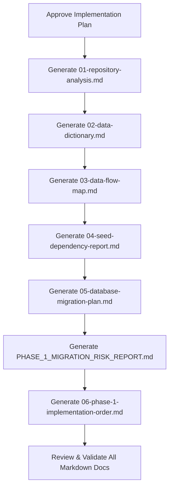

# Migration Architecture & Analysis Plan: From Mock Seed Data to Drizzle ORM & PostgreSQL / SQLite

## Executive Summary

This plan outlines the architecture analysis and documentation strategy for transitioning the **Morao Artisans Accounting** platform from its current static, mock-driven state (`src/data/seed.ts`) to a production-grade, multi-tenant database architecture powered by **Next.js 16 (App Router)**, **TypeScript**, **Drizzle ORM**, **PostgreSQL (Neon / Supabase)**, and optional **SQLite** (for Tauri desktop packaging).

- **Execution Context**: Clean-slate architectural documentation.
- **Safety**: Pure analysis and plan delivery — no destructive changes to functional application logic.
- **Output Destination**: All findings and blueprints will be committed directly to markdown documentation in `/home/accounting_software_shadcn/docs/`.

---

## 1. Repository Landscape & Current Baseline

### 1.1 Tech Stack
- **Framework**: Next.js 16.2.3 (App Router with React 19.2.4 Canary)
- **Styling**: Tailwind CSS v4 (`@tailwindcss/postcss`)
- **UI Components**: Base UI / Radix primitives styled with Tailwind and Lucide icons
- **Visualization**: Recharts 3.8.0
- **Animation**: Motion 12.38.0
- **Current Data Store**: Single monolithic file `src/data/seed.ts` (1,107 lines) exporting:
  - **16 TypeScript interfaces** (`BankAccount`, `Transaction`, `FullTransaction`, `CardData`, `Holding`, `WatchlistItem`, `BudgetCategory`, `SavingsGoal`, `TransferRecord`, `Notification`, `CryptoCoin`, `CryptoTransaction`, `HealthFactor`, `FaqItem`, `SupportTicket`, `RecurringCharge`)
  - **25 mock data constants & generators** (`bankAccounts`, `fullTransactions`, `cardsData`, `contacts`, `holdings`, `notifications`, `budgetCategories`, etc.)

### 1.2 Route & Directory Breakdown
- **`src/app/(auth)/`**: Client-side mock authentication forms (`/sign-in`, `/sign-up`) using simulated `setTimeout` delays with no session management.
- **`src/app/(dashboard)/`**: 15 distinct functional routes (`/dashboard`, `/accounts`, `/transactions`, `/transfers`, `/cards`, `/payable`, `/receivable`, `/analytics`, `/investments`, `/budgets`, `/vendors`, `/settings`, `/notifications`, `/support`, `/crypto` redirect).
- **`src/app/psi_dashboard/`**: Parallel route branch duplicating dashboard views for inventory/PSI workspace prototyping.
- **`src/components/`**: 14 domain-specific component folders + `src/components/ui` containing 24 shared primitive UI components.
- **`src/hooks/`**: Standalone `useIsMobile` responsive hook.
- **`src/lib/`**: `cn()` Tailwind class merging utility.

---

## 2. Core Architectural Discoveries & Anti-Patterns

1. **Direct Seed Imports Across All Layers**:
   - 52 distinct import statements directly reference `@/data/seed` across 38 client components, 7 server components, and layout utilities.
2. **Type Definition Coupling**:
   - Domain entity types (`BankAccount`, `CardData`, etc.) are defined inside `src/data/seed.ts`. UI components import business types from the mock seed file, making it impossible to remove the mock file without breaking TypeScript compilation.
3. **Ephemeral In-Memory State**:
   - Client components initialize local React state via `useState(seedData)` (e.g. `useState<BankAccount[]>(bankAccounts)` in `AccountsPageClient`).
   - Mutations (e.g. adding an account, generating a virtual card, sending a transfer, marking a notification as read) only modify local component RAM. Page reload or route change reverts all changes.
4. **Calculated Metrics in Presentation Layer**:
   - Totals, cash flows, net changes, and sparkline figures are calculated on the client inside rendering hooks (`useMemo`, `reduce`). This pattern will fail to scale once the database contains thousands of transactions.
5. **Security & PCI-DSS Violations in Virtual Card Generator**:
   - `VirtualCardGenerator` synthesizes raw 16-digit card numbers and 3-digit CVVs into client memory. Real-world financial systems must never store plaintext Primary Account Numbers (PAN) or CVVs in the application database.
6. **Cross-Component Desynchronization**:
   - Top sidebar notifications badge in `nav-secondary.tsx` reads directly from `notifications` in `seed.ts` at module evaluation time. Modifying notification status in `notifications-page-client.tsx` leaves the sidebar badge completely out of sync.

---

## 3. Scope of Documentation Deliverables

We have authored 6 primary analysis and migration documents plus a dedicated risk report inside `docs/`:

```
docs/
├── 01-repository-analysis.md
├── 02-data-dictionary.md
├── 03-data-flow-map.md
├── 04-seed-dependency-report.md
├── 05-database-migration-plan.md
├── 06-phase-1-implementation-order.md
├── PHASE_1_MIGRATION_RISK_REPORT.md
└── migration_analysis_plan.md
```

### Detailed Deliverable Breakdown

#### Deliverable 1: `01-repository-analysis.md`
- Complete directory tree and inventory of `src/app`, `src/components`, `src/hooks`, `src/lib`, and `src/data`.
- Identification and categorization of every file:
  - Server Components vs Client Components (`"use client"`).
  - Page entrypoints, layouts, loading skeletons, and error boundaries.
  - Primitive UI components (`src/components/ui/`) vs domain composite components.
  - Utility and hook dependencies.
- Detailed architecture map of routing groups `(auth)`, `(dashboard)`, and `psi_dashboard`.

#### Deliverable 2: `02-data-dictionary.md`
- Full documentation of all 16 existing TypeScript interfaces and 25 seed datasets.
- Field-by-field dictionary: Field name, TypeScript type, nullability, current mock sample, and component consumer.
- Target database mapping table:
  - Entity name
  - Current location in `seed.ts`
  - Component consumers
  - Proposed Drizzle ORM table name
  - Primary / Foreign key relations
  - Migration difficulty score (Low, Medium, High, Critical) with specific rationale.

#### Deliverable 3: `03-data-flow-map.md`
- Visual and textual data flow pipelines for every single page in the application:
  ```
  Page (Server Component)
    └── Page Client Component (State Container)
          └── Presentational Subcomponents
                ├── Current Data Source: static import from @/data/seed
                └── State Management: local useState / useMemo / synthetic setTimeout
  ```
- Detailed maps for all 15 routes: Dashboard, Accounts, Transactions, Transfers, Cards, Payable, Receivable, Analytics, Investments, Budgets, Vendors, Settings, Notifications, Support, and Auth.
- Identification of client-side calculated metrics that must transition to SQL aggregate queries.

#### Deliverable 4: `04-seed-dependency-report.md`
- Exhaustive cross-reference table of all 52 import instances from `@/data/seed`.
- Breakdown by file, imported symbols, usage mode (Read-only display, Interactive local state initialization, Static badge count calculation, or Mock mutation).
- Component-by-component coupling severity rating.

#### Deliverable 5: `05-database-migration-plan.md`
- Target stack architecture: Next.js 16.2.3 App Router + Drizzle ORM + PostgreSQL (with SQLite compatibility).
- Drizzle schema design:
  - Multi-tenant model: Control Plane (`users`, `organizations`, `organization_members`) and Tenant Plane (`bank_accounts`, `transactions`, `cards`, `contacts`, `transfers`, `budgets`, `savings_goals`, `holdings`, `notifications`, `support_tickets`).
  - Dual-dialect compatibility strategy (using Drizzle's portable column types for Postgres and SQLite).
- Repository & Service Layer Pattern:
  - `src/lib/db/`: Connection management and schema definitions.
  - `src/lib/services/`: Pure business logic and database queries (decoupled from Next.js request context).
  - Server Actions in `src/app/actions/`: Handling mutations, authorization, input validation (Zod), and cache invalidation via Next.js 16 `updateTag` and `refresh()`.

#### Deliverable 6: `06-phase-1-implementation-order.md`
- Safe, step-by-step sequential migration roadmap:
  - **Step 1**: Type Extraction (`src/types/` domain definitions decoupled from `seed.ts`).
  - **Step 2**: Drizzle Schema & Migration Setup (Postgres + SQLite).
  - **Step 3**: Database Seed Script (converting `seed.ts` to DB seeders).
  - **Step 4**: Service & Repository Layer Implementation.
  - **Step 5**: Server Actions & Data Fetching Integration (Page by page: Accounts -> Transactions -> Cards -> Transfers -> Budgets -> Analytics -> Support -> Notifications).
  - **Step 6**: UI Decoupling (Replacing `useState(seedData)` with props and server action hooks).
  - **Step 7**: Deprecation & Removal of `seed.ts`.
- File Classification Matrix:
  - `Keep Unchanged` (e.g. `src/components/ui/*`, `src/lib/utils.ts`, `src/hooks/*`)
  - `Possible Future Modification` (e.g. layout components, filters, tables receiving new prop contracts)
  - `Replace / Refactor Later` (e.g. `src/data/seed.ts`, `*page-client.tsx` state containers, auth mock handlers)
- Rollback and validation strategies.

#### Companion Deliverable: `PHASE_1_MIGRATION_RISK_REPORT.md`
- Comprehensive analysis of:
  - Direct seed import risks and circular dependency risks.
  - Ephemeral state risks and data loss vulnerabilities.
  - Presentation-layer business logic computation risks.
  - PCI-DSS compliance risks regarding card numbers.
  - Missing layers: loading states, error boundaries, input validation (Zod), and API retry mechanisms.
  - Mitigation strategies for each identified risk.

---

## 4. Execution Workflow


